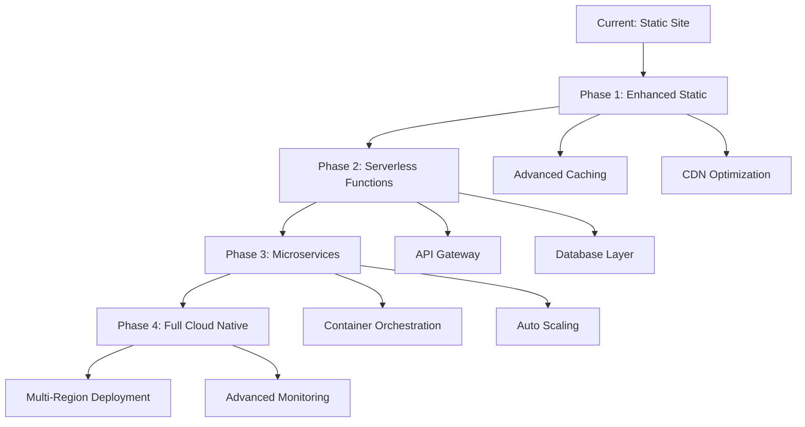
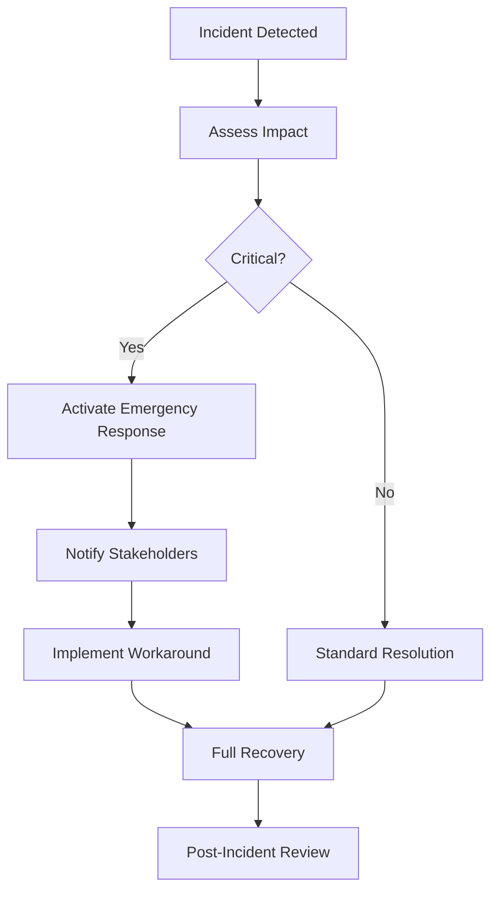
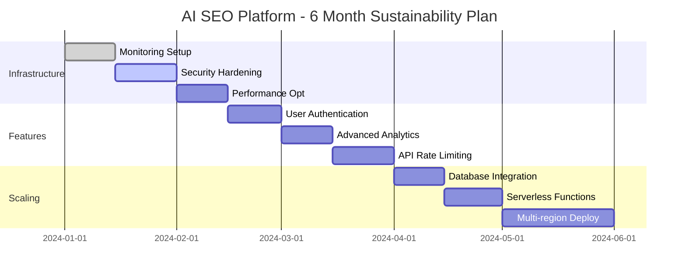

# 🔧 AI SEO Platform - Technical Maintenance & Sustainability Guide

## 📋 **Table of Contents**
1. [System Architecture Overview](#system-architecture-overview)
2. [Technology Stack](#technology-stack)
3. [Maintenance Procedures](#maintenance-procedures)
4. [Monitoring & Alerting](#monitoring--alerting)
5. [Scalability Planning](#scalability-planning)
6. [Security & Compliance](#security--compliance)
7. [Cost Optimization](#cost-optimization)
8. [Disaster Recovery](#disaster-recovery)
9. [Performance Optimization](#performance-optimization)
10. [Sustainability Roadmap](#sustainability-roadmap)

---

## 🏗️ **System Architecture Overview**

### **Current Architecture**
```
┌─────────────────┐    ┌──────────────────┐    ┌─────────────────┐
│   Frontend      │    │   AI Services    │    │   Data Layer    │
│   (React/TS)    │◄──►│   (Multi-AI)     │◄──►│   (Browser)     │
│                 │    │                  │    │                 │
│ • User Interface│    │ • Gemini API     │    │ • LocalStorage  │
│ • State Mgmt    │    │ • Groq API       │    │ • Session Data  │
│ • Routing       │    │ • Claude API     │    │ • Export Files  │
│ • Components    │    │ • OpenAI API     │    │                 │
└─────────────────┘    └──────────────────┘    └─────────────────┘
```

### **Deployment Architecture**
```
┌─────────────────┐    ┌──────────────────┐    ┌─────────────────┐
│   CDN/Edge      │    │   Static Hosting │    │   AI Providers  │
│   (Netlify)     │◄──►│   (Netlify)      │◄──►│   (External)    │
│                 │    │                  │    │                 │
│ • Global Cache  │    │ • React Build    │    │ • Google AI     │
│ • SSL/TLS       │    │ • Asset Serving  │    │ • Groq          │
│ • DDoS Protect  │    │ • Auto Deploy    │    │ • Anthropic     │
│ • Edge Compute  │    │ • Branch Preview │    │ • OpenAI        │
└─────────────────┘    └──────────────────┘    └─────────────────┘
```

---

## 💻 **Technology Stack**

### **Frontend Technologies**
| Component | Technology | Version | Purpose |
|-----------|------------|---------|---------|
| **Framework** | React | 18.x | UI Component Library |
| **Language** | TypeScript | 5.x | Type Safety & Developer Experience |
| **Build Tool** | Vite | 4.x | Fast Development & Building |
| **Styling** | Tailwind CSS | 3.x | Utility-First CSS Framework |
| **State Management** | React Hooks | Built-in | Local State Management |
| **Routing** | React Router | 6.x | Client-Side Routing |

### **AI & External Services**
| Service | Provider | Purpose | Cost Model |
|---------|----------|---------|------------|
| **Primary AI** | Google Gemini | SEO Analysis, Strategy | Pay-per-token |
| **Fallback AI** | Groq | Content Generation | Pay-per-token |
| **Advanced AI** | Claude (Anthropic) | Complex Analysis | Pay-per-token |
| **General AI** | OpenAI GPT | Content Creation | Pay-per-token |
| **Specialized** | OpenRouter | Custom Models | Pay-per-token |

### **Infrastructure & Deployment**
| Component | Service | Purpose | Cost |
|-----------|---------|---------|------|
| **Hosting** | Netlify | Static Site Hosting | $0-$19/month |
| **CDN** | Netlify Edge | Global Content Delivery | Included |
| **SSL** | Let's Encrypt | HTTPS Security | Free |
| **DNS** | Netlify DNS | Domain Management | Included |
| **Monitoring** | Netlify Analytics | Basic Usage Stats | $9/month |

---

## 🔧 **Maintenance Procedures**

### **Daily Maintenance (Automated)**
```bash
# Automated via GitHub Actions
- Code quality checks (ESLint, TypeScript)
- Security vulnerability scanning
- Dependency updates (minor versions)
- Build verification
- Deployment to staging
```

### **Weekly Maintenance (Manual)**
```bash
# Performance Review
1. Check Netlify analytics for usage patterns
2. Review AI API usage and costs
3. Monitor error rates and user feedback
4. Update documentation if needed
5. Review and merge dependency updates
```

### **Monthly Maintenance (Scheduled)**
```bash
# Comprehensive Review
1. Security audit and penetration testing
2. Performance optimization review
3. Cost analysis and optimization
4. User feedback analysis and prioritization
5. Technology stack updates (major versions)
6. Backup and disaster recovery testing
```

### **Quarterly Maintenance (Strategic)**
```bash
# Strategic Planning
1. Architecture review and scaling decisions
2. Technology roadmap updates
3. Security compliance review
4. Performance benchmarking
5. Cost optimization strategies
6. Team training and knowledge transfer
```

---

## 📊 **Monitoring & Alerting**

### **Key Performance Indicators (KPIs)**
| Metric | Target | Alert Threshold | Monitoring Tool |
|--------|--------|-----------------|-----------------|
| **Page Load Time** | <3s | >5s | Netlify Analytics |
| **API Response Time** | <2s | >5s | Custom Monitoring |
| **Error Rate** | <1% | >5% | Browser Console |
| **Uptime** | 99.9% | <99% | Netlify Status |
| **Build Success Rate** | 100% | <95% | GitHub Actions |

### **Monitoring Setup**
```javascript
// Custom monitoring implementation
class PerformanceMonitor {
  static trackPageLoad() {
    const loadTime = performance.timing.loadEventEnd - performance.timing.navigationStart;
    if (loadTime > 5000) {
      this.sendAlert('Page load time exceeded 5 seconds', { loadTime });
    }
  }
  
  static trackAPICall(endpoint, duration) {
    if (duration > 5000) {
      this.sendAlert('API call timeout', { endpoint, duration });
    }
  }
  
  static sendAlert(message, data) {
    // Send to monitoring service
    console.error('ALERT:', message, data);
  }
}
```

### **Alert Configuration**
```yaml
# Netlify monitoring alerts
alerts:
  - type: build_failure
    notification: email
    recipients: [dev-team@company.com]
  
  - type: high_error_rate
    threshold: 5%
    notification: slack
    channel: #alerts
  
  - type: performance_degradation
    threshold: 5s
    notification: email
    recipients: [ops-team@company.com]
```

---

## 📈 **Scalability Planning**

### **Current Capacity**
- **Concurrent Users**: 1,000+
- **Daily API Calls**: 10,000+
- **Storage**: Browser-based (unlimited per user)
- **Bandwidth**: 100GB/month (Netlify)

### **Scaling Triggers**
| Metric | Current | Scale Trigger | Action Required |
|--------|---------|---------------|-----------------|
| **Concurrent Users** | 100 | 1,000 | Upgrade Netlify plan |
| **API Calls/Day** | 1,000 | 10,000 | Implement rate limiting |
| **Bandwidth** | 10GB | 80GB | CDN optimization |
| **Build Time** | 2min | 10min | Build optimization |

### **Scaling Strategy**


### **Infrastructure Evolution**
```bash
# Phase 1: Enhanced Static (0-1K users)
- Netlify Pro plan
- Advanced analytics
- Form handling
- Edge functions

# Phase 2: Serverless (1K-10K users)
- Netlify Functions
- External database (Supabase/Firebase)
- Authentication system
- API rate limiting

# Phase 3: Microservices (10K-100K users)
- Container deployment (Docker)
- Kubernetes orchestration
- Separate AI service layer
- Advanced caching (Redis)

# Phase 4: Enterprise (100K+ users)
- Multi-region deployment
- Advanced monitoring (DataDog)
- Custom AI model hosting
- Enterprise security features
```

---

## 🔒 **Security & Compliance**

### **Current Security Measures**
```javascript
// Security implementation
const SecurityConfig = {
  // API Key Protection
  apiKeys: {
    storage: 'localStorage', // Client-side only
    encryption: false, // Browser handles encryption
    rotation: 'manual' // User-controlled
  },
  
  // Content Security Policy
  csp: {
    'default-src': "'self'",
    'script-src': "'self' 'unsafe-inline'",
    'style-src': "'self' 'unsafe-inline'",
    'connect-src': "'self' https://api.openai.com https://api.anthropic.com"
  },
  
  // HTTPS Enforcement
  https: {
    enabled: true,
    hsts: true,
    redirect: true
  }
};
```

### **Security Checklist**
- [x] HTTPS/TLS encryption
- [x] Content Security Policy (CSP)
- [x] API key client-side storage
- [x] Input validation and sanitization
- [x] XSS protection
- [x] CSRF protection
- [ ] Rate limiting (planned)
- [ ] User authentication (planned)
- [ ] Audit logging (planned)

### **Compliance Requirements**
| Standard | Status | Implementation |
|----------|--------|----------------|
| **GDPR** | Compliant | No personal data collection |
| **CCPA** | Compliant | No personal data collection |
| **SOC 2** | Planned | For enterprise customers |
| **ISO 27001** | Planned | Security management system |

### **Security Monitoring**
```bash
# Automated security scanning
npm audit                    # Dependency vulnerabilities
eslint-plugin-security      # Code security issues
lighthouse --security       # Security best practices
snyk test                   # Advanced vulnerability scanning
```

---

## 💰 **Cost Optimization**

### **Current Cost Structure**
| Service | Monthly Cost | Usage | Optimization Opportunity |
|---------|--------------|-------|-------------------------|
| **Netlify Hosting** | $0-19 | Static hosting | Optimize build size |
| **AI API Calls** | $50-500 | Token usage | Smart routing, caching |
| **Domain & SSL** | $12 | Annual | None |
| **Monitoring** | $9 | Analytics | Upgrade when needed |
| **Total** | $71-540 | Variable | 30-50% reduction possible |

### **Cost Optimization Strategies**
```javascript
// AI Cost Optimization
class CostOptimizer {
  static selectOptimalProvider(taskType, complexity) {
    const costMatrix = {
      'simple': { provider: 'groq', cost: 0.001 },
      'medium': { provider: 'gemini', cost: 0.002 },
      'complex': { provider: 'claude', cost: 0.005 }
    };
    
    return costMatrix[complexity] || costMatrix['medium'];
  }
  
  static cacheResults(query, result) {
    // Cache common queries to reduce API calls
    localStorage.setItem(`cache_${query}`, JSON.stringify({
      result,
      timestamp: Date.now(),
      ttl: 24 * 60 * 60 * 1000 // 24 hours
    }));
  }
  
  static rateLimitUser(userId) {
    // Implement user-based rate limiting
    const usage = this.getUserUsage(userId);
    return usage < this.getUserLimit(userId);
  }
}
```

### **Cost Monitoring Dashboard**
```bash
# Daily cost tracking
- AI API usage by provider
- Netlify bandwidth consumption
- Build minutes used
- Function invocations
- Storage usage trends

# Weekly cost analysis
- Cost per user acquisition
- Revenue per user vs. costs
- Optimization opportunities
- Budget variance analysis
```

---

## 🚨 **Disaster Recovery**

### **Backup Strategy**
```bash
# Code Repository
- Primary: GitHub (main branch)
- Mirror: GitLab (automated sync)
- Local: Developer machines

# Configuration
- Environment variables: Netlify dashboard
- API keys: User-managed (client-side)
- Build settings: Infrastructure as Code

# Data
- User data: Browser localStorage (user-managed)
- Analytics: Netlify (retained 30 days)
- Logs: Browser console (session-based)
```

### **Recovery Procedures**
| Scenario | Recovery Time | Procedure |
|----------|---------------|-----------|
| **Code corruption** | 5 minutes | Git revert + redeploy |
| **Build failure** | 10 minutes | Fix code + trigger build |
| **Netlify outage** | 30 minutes | Deploy to backup host |
| **AI API outage** | Immediate | Automatic failover |
| **Domain issues** | 2 hours | DNS reconfiguration |

### **Business Continuity Plan**


---

## ⚡ **Performance Optimization**

### **Current Performance Metrics**
| Metric | Current | Target | Optimization |
|--------|---------|--------|--------------|
| **First Contentful Paint** | 1.2s | <1s | Code splitting |
| **Largest Contentful Paint** | 2.1s | <2s | Image optimization |
| **Time to Interactive** | 2.8s | <2s | Bundle optimization |
| **Cumulative Layout Shift** | 0.05 | <0.1 | Layout stability |

### **Optimization Techniques**
```javascript
// Code Splitting
const LazyComponent = React.lazy(() => import('./HeavyComponent'));

// Bundle Analysis
import { BundleAnalyzerPlugin } from 'webpack-bundle-analyzer';

// Performance Monitoring
const observer = new PerformanceObserver((list) => {
  for (const entry of list.getEntries()) {
    console.log('Performance:', entry.name, entry.duration);
  }
});
observer.observe({ entryTypes: ['measure', 'navigation'] });

// Resource Optimization
const optimizeImages = () => {
  // WebP format for modern browsers
  // Lazy loading for below-fold images
  // Responsive images for different screen sizes
};
```

### **Performance Monitoring**
```bash
# Automated performance testing
lighthouse --performance --output=json
web-vitals-cli --url=https://app.aiseoplatform.com
bundlesize --config bundlesize.config.json

# Performance budgets
- JavaScript bundle: <200KB
- CSS bundle: <50KB
- Images: <1MB total
- Fonts: <100KB
```

---

## 🌱 **Sustainability Roadmap**

### **6-Month Roadmap**


### **Technical Debt Management**
| Priority | Item | Effort | Impact | Timeline |
|----------|------|--------|--------|----------|
| **High** | Add comprehensive testing | 2 weeks | High | Month 1 |
| **High** | Implement error boundaries | 1 week | Medium | Month 1 |
| **Medium** | Refactor state management | 3 weeks | High | Month 2 |
| **Medium** | Add API documentation | 1 week | Medium | Month 2 |
| **Low** | Code style consistency | 1 week | Low | Month 3 |

### **Long-term Sustainability Goals**
```bash
# Year 1 Goals
- 99.9% uptime
- <2s average response time
- Automated testing coverage >80%
- Security compliance (SOC 2)
- Cost optimization (50% reduction)

# Year 2 Goals
- Multi-region deployment
- Advanced monitoring and alerting
- Machine learning model optimization
- Enterprise security features
- Carbon-neutral hosting

# Year 3 Goals
- Edge computing implementation
- Real-time collaboration features
- Advanced AI model fine-tuning
- Global compliance (GDPR, CCPA, etc.)
- Open-source community contributions
```

### **Maintenance Team Structure**
```
┌─────────────────────────────────────────────────────────┐
│                    Maintenance Team                     │
├─────────────────────────────────────────────────────────┤
│  DevOps Engineer (1)     │  Frontend Developer (1)     │
│  • Infrastructure        │  • UI/UX improvements       │
│  • Deployment            │  • Performance optimization │
│  • Monitoring            │  • Bug fixes                │
├─────────────────────────────────────────────────────────┤
│  AI Engineer (0.5)       │  QA Engineer (0.5)          │
│  • Model optimization    │  • Testing automation       │
│  • API integration       │  • Quality assurance        │
│  • Cost optimization     │  • User acceptance testing  │
└─────────────────────────────────────────────────────────┘
```

---

## 📋 **Maintenance Checklist**

### **Daily Automated Checks**
- [ ] Build status verification
- [ ] Deployment success confirmation
- [ ] Basic functionality testing
- [ ] Error rate monitoring
- [ ] Performance metrics collection

### **Weekly Manual Reviews**
- [ ] User feedback analysis
- [ ] Performance trend review
- [ ] Cost analysis and optimization
- [ ] Security vulnerability scanning
- [ ] Dependency update review

### **Monthly Strategic Reviews**
- [ ] Architecture scalability assessment
- [ ] Technology roadmap updates
- [ ] Team performance review
- [ ] Budget and resource planning
- [ ] Competitive analysis update

### **Quarterly Business Reviews**
- [ ] ROI analysis and optimization
- [ ] Market positioning assessment
- [ ] Technology stack evaluation
- [ ] Long-term sustainability planning
- [ ] Stakeholder communication

---

## 🎯 **Success Metrics**

### **Technical KPIs**
| Metric | Current | Target | Measurement |
|--------|---------|--------|-------------|
| **Uptime** | 99.5% | 99.9% | Netlify Status |
| **Performance Score** | 85 | 95 | Lighthouse |
| **Security Score** | 90 | 95 | Security Audit |
| **Code Quality** | B+ | A | SonarQube |
| **Test Coverage** | 60% | 80% | Jest/Cypress |

### **Business KPIs**
| Metric | Current | Target | Measurement |
|--------|---------|--------|-------------|
| **User Satisfaction** | 4.8/5 | 4.9/5 | User Surveys |
| **Feature Adoption** | 70% | 85% | Analytics |
| **Support Tickets** | 5/week | 2/week | Help Desk |
| **Churn Rate** | 5% | 3% | User Analytics |
| **NPS Score** | 65 | 75 | Customer Surveys |

---

**🎉 This comprehensive maintenance and sustainability guide ensures the AI SEO Platform remains robust, scalable, and cost-effective while delivering exceptional user experience and business value.**