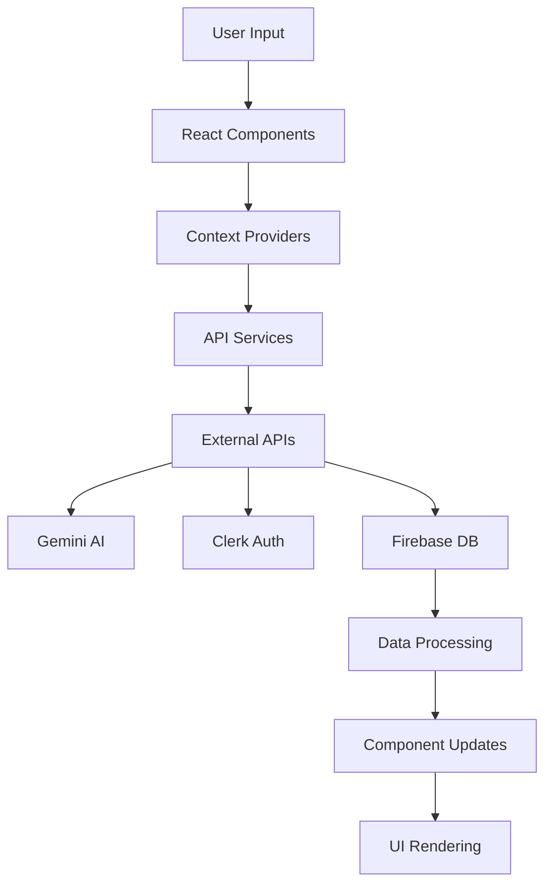

# AI SEO Automation Platform - Developer Guide

## Table of Contents

1. [Architecture Overview](#architecture-overview)
2. [Authentication System](#authentication-system)
3. [Full Stack Implementation](#full-stack-implementation)
4. [Production Deployment](#production-deployment)
5. [Invite-Only User System](#invite-only-user-system)
6. [Maintenance Procedures](#maintenance-procedures)
7. [Monitoring & Analytics](#monitoring--analytics)
8. [Security Best Practices](#security-best-practices)

---

## Architecture Overview

### Technology Stack

```typescript
// Frontend Stack
React 19.1.1        // UI Framework
TypeScript 5.8.2    // Type Safety
Tailwind CSS 3.4.17 // Styling
Vite 6.2.0          // Build Tool

// Backend Services
Google Gemini AI    // Content Generation
Clerk               // Authentication
Firebase            // Database & Storage
Netlify             // Hosting & Deployment
```

### Component Architecture

```
src/
├── components/              # React Components
│   ├── auth/               # Authentication components
│   ├── dashboard/          # Dashboard components
│   ├── forms/              # Form components
│   ├── modals/             # Modal components
│   └── shared/             # Shared/common components
├── context/                # React Context Providers
├── services/               # API service layer
├── hooks/                  # Custom React hooks
├── utils/                  # Utility functions
├── types/                  # TypeScript type definitions
└── constants/              # Application constants
```

### Data Flow



---

## Authentication System

### Current Implementation (Demo Users)

#### Demo User Context

```typescript
// context/DemoAuthContext.tsx
interface DemoUser {
  id: string;
  username: string;
  firstName: string;
  lastName: string;
  email: string;
  company: string;
  industry: string;
  role: string;
  avatar?: string;
}

export const DemoAuthProvider: React.FC<{ children: React.ReactNode }> = ({ children }) => {
  const [currentUser, setCurrentUser] = useState<DemoUser | null>(null);
  const [isAuthenticated, setIsAuthenticated] = useState(false);

  const login = (username: string) => {
    const user = demoUsers.find(u => u.username === username);
    if (user) {
      setCurrentUser(user);
      setIsAuthenticated(true);
      localStorage.setItem('demoUser', JSON.stringify(user));
    }
  };

  const logout = () => {
    setCurrentUser(null);
    setIsAuthenticated(false);
    localStorage.removeItem('demoUser');
  };

  return (
    <DemoAuthContext.Provider value={{ currentUser, isAuthenticated, login, logout }}>
      {children}
    </DemoAuthContext.Provider>
  );
};
```

#### Demo Users Configuration

```typescript
// demoUsers.ts
export const demoUsers: DemoUser[] = [
  // Healthcare Professionals
  {
    id: "demo-1",
    username: "drpratichi",
    firstName: "Pratichi",
    lastName: "Sharma",
    email: "pratichi.sharma@healthplus.clinic",
    company: "HealthPlus Clinic",
    industry: "Healthcare",
    role: "Chief Cardiologist"
  },
  {
    id: "demo-2", 
    username: "drsatish",
    firstName: "Satish",
    lastName: "Kumar",
    email: "satish.kumar@orthocenter.clinic",
    company: "Advanced Orthopedic Center",
    industry: "Healthcare",
    role: "Senior Orthopedic Surgeon"
  },
  // Business Leaders
  {
    id: "demo-3",
    username: "raghab",
    firstName: "Raghab",
    lastName: "Singh", 
    email: "raghab.singh@learntech.edu",
    company: "LearnTech Solutions",
    industry: "Education",
    role: "CEO & Founder"
  },
  // Marketing Executives (CMO1-CMO10)
  ...Array.from({ length: 10 }, (_, i) => ({
    id: `demo-cmo-${i + 1}`,
    username: `CMO${i + 1}`,
    firstName: `Marketing`,
    lastName: `Executive ${i + 1}`,
    email: `cmo${i + 1}@company${i + 1}.com`,
    company: `Company ${i + 1}`,
    industry: "Marketing",
    role: "Chief Marketing Officer"
  }))
];
```

### Production Authentication (Clerk Integration)

#### Environment Setup

```env
# Production Environment Variables
VITE_CLERK_PUBLISHABLE_KEY=pk_live_your_live_key
CLERK_SECRET_KEY=sk_live_your_secret_key
CLERK_WEBHOOK_SECRET=whsec_your_webhook_secret

# Database Configuration  
FIREBASE_API_KEY=your_firebase_api_key
FIREBASE_AUTH_DOMAIN=your-project.firebaseapp.com
FIREBASE_PROJECT_ID=your-project-id
FIREBASE_STORAGE_BUCKET=your-project.appspot.com
FIREBASE_MESSAGING_SENDER_ID=123456789
FIREBASE_APP_ID=1:123456789:web:abcdef123456

# AI Services
GEMINI_API_KEY=your_gemini_api_key_here
```

#### Clerk Configuration

```typescript
// main.tsx or App.tsx
import { ClerkProvider } from '@clerk/clerk-react';

const clerkPubKey = import.meta.env.VITE_CLERK_PUBLISHABLE_KEY;

if (!clerkPubKey) {
  throw new Error("Missing Publishable Key");
}

function App() {
  return (
    <ClerkProvider publishableKey={clerkPubKey}>
      <Router>
        <Routes>
          <Route path="/sign-in/*" element={<SignInPage />} />
          <Route path="/sign-up/*" element={<SignUpPage />} />
          <Route path="/" element={<ProtectedPage />} />
        </Routes>
      </Router>
    </ClerkProvider>
  );
}
```

#### Protected Routes

```typescript
// components/ProtectedRoute.tsx
import { useAuth } from '@clerk/clerk-react';
import { Navigate } from 'react-router-dom';

export const ProtectedRoute: React.FC<{ children: React.ReactNode }> = ({ children }) => {
  const { isLoaded, isSignedIn } = useAuth();

  if (!isLoaded) {
    return <LoadingSpinner />;
  }

  if (!isSignedIn) {
    return <Navigate to="/sign-in" replace />;
  }

  return <>{children}</>;
};
```

---

## Full Stack Implementation

### Frontend Architecture

#### State Management

```typescript
// hooks/useAppState.ts
export const useAppState = () => {
  const [brandData, setBrandData] = useState<BrandData | null>(null);
  const [seoAudit, setSeoAudit] = useState<SeoAudit | null>(null);
  const [keywordStrategy, setKeywordStrategy] = useState<KeywordStrategy | null>(null);
  const [contentPlan, setContentPlan] = useState<ContentPlan | null>(null);
  const [loading, setLoading] = useState<LoadingState>({
    foundation: false,
    keywords: false,
    content: false,
    calendar: false,
    technical: false,
    conversion: false,
    performance: false
  });

  return {
    brandData,
    setBrandData,
    seoAudit,
    setSeoAudit,
    keywordStrategy,
    setKeywordStrategy,
    contentPlan,
    setContentPlan,
    loading,
    setLoading
  };
};
```

#### API Service Layer

```typescript
// services/aiService.ts
export class GeminiService implements AIService {
  private apiKey: string;
  private model: any;

  constructor(apiKey: string) {
    this.apiKey = apiKey;
    this.model = new GoogleGenerativeAI(apiKey).getGenerativeModel({ 
      model: "gemini-pro" 
    });
  }

  async generateSeoAudit(brandData: BrandData): Promise<SeoAudit> {
    const prompt = this.buildSeoAuditPrompt(brandData);
    const result = await this.model.generateContent(prompt);
    return this.parseSeoAuditResponse(result.response.text());
  }

  async generateKeywordStrategy(brandData: BrandData, seoAudit: SeoAudit): Promise<KeywordStrategy> {
    const prompt = this.buildKeywordPrompt(brandData, seoAudit);
    const result = await this.model.generateContent(prompt);
    return this.parseKeywordResponse(result.response.text());
  }

  async generateContentPlan(brandData: BrandData, keywords: KeywordStrategy): Promise<ContentPlan> {
    const prompt = this.buildContentPrompt(brandData, keywords);
    const result = await this.model.generateContent(prompt);
    return this.parseContentResponse(result.response.text());
  }

  private buildSeoAuditPrompt(brandData: BrandData): string {
    return `
      Generate a comprehensive SEO audit for the following business:
      
      Business: ${brandData.name}
      Website: ${brandData.website}
      Industry: ${brandData.businessType}
      Location: ${brandData.specificLocations}
      Services: ${brandData.keyServices}
      
      Please provide:
      1. Overall SEO score (0-100)
      2. Technical SEO analysis
      3. Content quality assessment
      4. Backlink profile analysis
      5. Local SEO opportunities
      6. Competitor analysis
      7. Specific recommendations
      
      Format the response as valid JSON matching the SeoAudit interface.
    `;
  }
}
```

#### Data Persistence

```typescript
// services/firebaseService.ts
import { initializeApp } from 'firebase/app';
import { getFirestore, doc, setDoc, getDoc, collection, query, where, getDocs } from 'firebase/firestore';
import { getAuth } from 'firebase/auth';

const firebaseConfig = {
  apiKey: import.meta.env.FIREBASE_API_KEY,
  authDomain: import.meta.env.FIREBASE_AUTH_DOMAIN,
  projectId: import.meta.env.FIREBASE_PROJECT_ID,
  storageBucket: import.meta.env.FIREBASE_STORAGE_BUCKET,
  messagingSenderId: import.meta.env.FIREBASE_MESSAGING_SENDER_ID,
  appId: import.meta.env.FIREBASE_APP_ID
};

const app = initializeApp(firebaseConfig);
const db = getFirestore(app);
const auth = getAuth(app);

export class DatabaseService {
  async saveProject(userId: string, project: Project): Promise<void> {
    const projectRef = doc(db, 'projects', project.id);
    await setDoc(projectRef, {
      ...project,
      userId,
      updatedAt: new Date().toISOString()
    });
  }

  async getUserProjects(userId: string): Promise<Project[]> {
    const q = query(
      collection(db, 'projects'),
      where('userId', '==', userId)
    );
    const querySnapshot = await getDocs(q);
    return querySnapshot.docs.map(doc => doc.data() as Project);
  }

  async getProject(projectId: string): Promise<Project | null> {
    const projectRef = doc(db, 'projects', projectId);
    const projectSnap = await getDoc(projectRef);
    
    if (projectSnap.exists()) {
      return projectSnap.data() as Project;
    }
    
    return null;
  }
}
```

### Backend Services Integration

#### API Rate Limiting

```typescript
// services/rateLimiter.ts
class RateLimiter {
  private requests: Map<string, number[]> = new Map();
  private readonly maxRequests: number;
  private readonly windowMs: number;

  constructor(maxRequests: number = 60, windowMs: number = 60000) {
    this.maxRequests = maxRequests;
    this.windowMs = windowMs;
  }

  canMakeRequest(userId: string): boolean {
    const now = Date.now();
    const userRequests = this.requests.get(userId) || [];
    
    // Remove old requests outside the window
    const validRequests = userRequests.filter(
      timestamp => now - timestamp < this.windowMs
    );
    
    if (validRequests.length >= this.maxRequests) {
      return false;
    }
    
    validRequests.push(now);
    this.requests.set(userId, validRequests);
    return true;
  }
}

export const geminiRateLimiter = new RateLimiter(20, 60000); // 20 requests per minute
```

#### Error Handling

```typescript
// services/errorHandler.ts
export class APIError extends Error {
  constructor(
    message: string,
    public statusCode: number,
    public code?: string
  ) {
    super(message);
    this.name = 'APIError';
  }
}

export const handleAPIError = (error: any): APIError => {
  if (error.response) {
    // HTTP error response
    return new APIError(
      error.response.data?.message || 'API request failed',
      error.response.status,
      error.response.data?.code
    );
  } else if (error.request) {
    // Network error
    return new APIError('Network error', 0, 'NETWORK_ERROR');
  } else {
    // Other error
    return new APIError(error.message || 'Unknown error', 500, 'UNKNOWN_ERROR');
  }
};
```

---

## Production Deployment

### Build Configuration

#### Vite Configuration

```typescript
// vite.config.ts
import { defineConfig } from 'vite';
import react from '@vitejs/plugin-react';
import { resolve } from 'path';

export default defineConfig({
  plugins: [react()],
  server: {
    port: 3000,
    host: true
  },
  build: {
    outDir: 'dist',
    sourcemap: false,
    rollupOptions: {
      output: {
        manualChunks: {
          vendor: ['react', 'react-dom'],
          clerk: ['@clerk/clerk-react'],
          firebase: ['firebase/app', 'firebase/firestore', 'firebase/auth'],
          ai: ['@google/genai']
        }
      }
    }
  },
  resolve: {
    alias: {
      '@': resolve(__dirname, './src'),
      '@components': resolve(__dirname, './src/components'),
      '@services': resolve(__dirname, './src/services'),
      '@hooks': resolve(__dirname, './src/hooks'),
      '@utils': resolve(__dirname, './src/utils')
    }
  },
  define: {
    'process.env.NODE_ENV': JSON.stringify(process.env.NODE_ENV || 'development')
  }
});
```

#### Package.json Scripts

```json
{
  "scripts": {
    "dev": "vite --port 3000",
    "build": "tsc && vite build",
    "preview": "vite preview",
    "lint": "eslint . --ext ts,tsx --report-unused-disable-directives --max-warnings 0",
    "lint:fix": "eslint . --ext ts,tsx --fix",
    "type-check": "tsc --noEmit",
    "test": "vitest",
    "test:ui": "vitest --ui",
    "test:coverage": "vitest --coverage",
    "check-env": "node check-env.js",
    "build:analyze": "npm run build && npx vite-bundle-analyzer dist/assets/*.js",
    "deploy": "npm run build && netlify deploy --prod --dir dist"
  }
}
```

### Netlify Deployment

#### netlify.toml Configuration

```toml
[build]
  publish = "dist"
  command = "npm run build"

[build.environment]
  NODE_VERSION = "18"
  NPM_VERSION = "9"

[[redirects]]
  from = "/*"
  to = "/index.html"
  status = 200

[[headers]]
  for = "/*"
  [headers.values]
    X-Frame-Options = "DENY"
    X-XSS-Protection = "1; mode=block"
    X-Content-Type-Options = "nosniff"
    Referrer-Policy = "strict-origin-when-cross-origin"
    Content-Security-Policy = "default-src 'self'; script-src 'self' 'unsafe-inline' 'unsafe-eval' https://clerk.clerk.dev https://apis.google.com; style-src 'self' 'unsafe-inline' https://fonts.googleapis.com; font-src 'self' https://fonts.gstatic.com; img-src 'self' data: https:; connect-src 'self' https://api.clerk.dev https://generativelanguage.googleapis.com https://*.firebaseio.com"

[[headers]]
  for = "/static/*"
  [headers.values]
    Cache-Control = "public, max-age=31536000, immutable"

[functions]
  directory = "netlify/functions"
  node_bundler = "esbuild"
```

#### Environment Variables Setup

```bash
# Production Environment Setup Script
#!/bin/bash

# Set production environment variables
netlify env:set VITE_CLERK_PUBLISHABLE_KEY "pk_live_your_live_key"
netlify env:set CLERK_SECRET_KEY "sk_live_your_secret_key"
netlify env:set GEMINI_API_KEY "your_gemini_api_key"
netlify env:set FIREBASE_API_KEY "your_firebase_api_key"
netlify env:set FIREBASE_AUTH_DOMAIN "your-project.firebaseapp.com"
netlify env:set FIREBASE_PROJECT_ID "your-project-id"
netlify env:set FIREBASE_STORAGE_BUCKET "your-project.appspot.com"
netlify env:set FIREBASE_MESSAGING_SENDER_ID "123456789"
netlify env:set FIREBASE_APP_ID "1:123456789:web:abcdef123456"
netlify env:set NODE_ENV "production"

echo "Environment variables set successfully"
```

### CI/CD Pipeline

#### GitHub Actions Workflow

```yaml
# .github/workflows/deploy.yml
name: Deploy to Netlify

on:
  push:
    branches: [main]
  pull_request:
    branches: [main]

jobs:
  build-and-deploy:
    runs-on: ubuntu-latest
    
    steps:
    - name: Checkout code
      uses: actions/checkout@v3
      
    - name: Setup Node.js
      uses: actions/setup-node@v3
      with:
        node-version: '18'
        cache: 'npm'
        
    - name: Install dependencies
      run: npm ci
      
    - name: Run type checking
      run: npm run type-check
      
    - name: Run linting
      run: npm run lint
      
    - name: Run tests
      run: npm run test
      
    - name: Build application
      run: npm run build
      env:
        VITE_CLERK_PUBLISHABLE_KEY: ${{ secrets.VITE_CLERK_PUBLISHABLE_KEY }}
        GEMINI_API_KEY: ${{ secrets.GEMINI_API_KEY }}
        
    - name: Deploy to Netlify
      uses: netlify/actions/cli@master
      with:
        args: deploy --dir=dist --functions=netlify/functions
      env:
        NETLIFY_AUTH_TOKEN: ${{ secrets.NETLIFY_AUTH_TOKEN }}
        NETLIFY_SITE_ID: ${{ secrets.NETLIFY_SITE_ID }}
```

---

## Invite-Only User System

### Implementation Strategy

#### Phase 1: Organization-Based Invitations

```typescript
// services/invitationService.ts
export class InvitationService {
  private clerk: Clerk;
  private db: DatabaseService;

  constructor() {
    this.clerk = new Clerk(process.env.CLERK_SECRET_KEY!);
    this.db = new DatabaseService();
  }

  async createOrganizationInvitation(
    organizationId: string,
    email: string,
    role: 'admin' | 'member',
    invitedBy: string
  ): Promise<Invitation> {
    // Create invitation in Clerk
    const clerkInvitation = await this.clerk.organizations.createInvitation({
      organizationId,
      emailAddress: email,
      role
    });

    // Store invitation details in database
    const invitation: Invitation = {
      id: clerkInvitation.id,
      organizationId,
      email,
      role,
      status: 'pending',
      invitedBy,
      invitedAt: new Date().toISOString(),
      expiresAt: new Date(Date.now() + 7 * 24 * 60 * 60 * 1000).toISOString() // 7 days
    };

    await this.db.saveInvitation(invitation);
    return invitation;
  }

  async acceptInvitation(invitationId: string, userId: string): Promise<void> {
    const invitation = await this.db.getInvitation(invitationId);
    
    if (!invitation || invitation.status !== 'pending') {
      throw new Error('Invalid or expired invitation');
    }

    if (new Date() > new Date(invitation.expiresAt)) {
      throw new Error('Invitation has expired');
    }

    // Accept invitation in Clerk
    await this.clerk.organizations.acceptInvitation({
      invitationId,
      userId
    });

    // Update invitation status
    await this.db.updateInvitation(invitationId, {
      status: 'accepted',
      acceptedBy: userId,
      acceptedAt: new Date().toISOString()
    });
  }
}
```

#### Phase 2: Admin Panel Implementation

```typescript
// components/admin/UserManagement.tsx
export const UserManagement: React.FC = () => {
  const [invitations, setInvitations] = useState<Invitation[]>([]);
  const [users, setUsers] = useState<User[]>([]);
  const { user } = useUser();
  const invitationService = new InvitationService();

  const sendInvitation = async (email: string, role: 'admin' | 'member') => {
    try {
      await invitationService.createOrganizationInvitation(
        user!.organizationMemberships[0].organization.id,
        email,
        role,
        user!.id
      );
      
      // Refresh invitations list
      await loadInvitations();
      
      toast.success('Invitation sent successfully');
    } catch (error) {
      toast.error('Failed to send invitation');
    }
  };

  const revokeInvitation = async (invitationId: string) => {
    try {
      await invitationService.revokeInvitation(invitationId);
      await loadInvitations();
      toast.success('Invitation revoked');
    } catch (error) {
      toast.error('Failed to revoke invitation');
    }
  };

  return (
    <div className="user-management">
      <div className="invite-section">
        <h2>Invite New Users</h2>
        <InviteUserForm onSubmit={sendInvitation} />
      </div>
      
      <div className="pending-invitations">
        <h2>Pending Invitations</h2>
        <InvitationsList 
          invitations={invitations}
          onRevoke={revokeInvitation}
        />
      </div>
      
      <div className="organization-members">
        <h2>Organization Members</h2>
        <UsersList users={users} />
      </div>
    </div>
  );
};
```

#### Phase 3: Role-Based Access Control

```typescript
// hooks/usePermissions.ts
export const usePermissions = () => {
  const { user } = useUser();
  
  const permissions = useMemo(() => {
    if (!user || !user.organizationMemberships.length) {
      return {
        canInviteUsers: false,
        canManageUsers: false,
        canCreateProjects: false,
        canDeleteProjects: false,
        canExportData: true,
        canAccessAnalytics: true
      };
    }

    const role = user.organizationMemberships[0].role;
    
    switch (role) {
      case 'admin':
        return {
          canInviteUsers: true,
          canManageUsers: true,
          canCreateProjects: true,
          canDeleteProjects: true,
          canExportData: true,
          canAccessAnalytics: true
        };
        
      case 'member':
        return {
          canInviteUsers: false,
          canManageUsers: false,
          canCreateProjects: true,
          canDeleteProjects: false,
          canExportData: true,
          canAccessAnalytics: true
        };
        
      default:
        return {
          canInviteUsers: false,
          canManageUsers: false,
          canCreateProjects: false,
          canDeleteProjects: false,
          canExportData: true,
          canAccessAnalytics: false
        };
    }
  }, [user]);

  return permissions;
};
```

#### Email Templates

```typescript
// services/emailService.ts
export class EmailService {
  async sendInvitationEmail(invitation: Invitation): Promise<void> {
    const template = `
      <!DOCTYPE html>
      <html>
        <head>
          <meta charset="utf-8">
          <title>Invitation to AI SEO Platform</title>
        </head>
        <body style="font-family: Arial, sans-serif; max-width: 600px; margin: 0 auto; padding: 20px;">
          <div style="background: linear-gradient(135deg, #667eea 0%, #764ba2 100%); padding: 30px; text-align: center; border-radius: 10px 10px 0 0;">
            <h1 style="color: white; margin: 0;">🚀 AI SEO Automation Platform</h1>
            <p style="color: white; margin: 10px 0 0 0;">You've been invited to join our platform</p>
          </div>
          
          <div style="background: #f8f9fa; padding: 30px; border-radius: 0 0 10px 10px;">
            <h2 style="color: #333; margin-top: 0;">Welcome to the Future of SEO!</h2>
            
            <p style="color: #666; line-height: 1.6;">
              You've been invited to join the AI SEO Automation Platform, where you can:
            </p>
            
            <ul style="color: #666; line-height: 1.8;">
              <li>🔍 Generate comprehensive SEO audits</li>
              <li>📊 Create data-driven keyword strategies</li>
              <li>📝 Plan content and social media campaigns</li>
              <li>⚡ Implement technical SEO optimizations</li>
              <li>💰 Track ROI and performance metrics</li>
            </ul>
            
            <div style="text-align: center; margin: 30px 0;">
              <a href="${process.env.VITE_APP_URL}/accept-invitation?token=${invitation.id}" 
                 style="background: linear-gradient(135deg, #667eea 0%, #764ba2 100%); 
                        color: white; 
                        padding: 15px 30px; 
                        text-decoration: none; 
                        border-radius: 5px; 
                        display: inline-block;
                        font-weight: bold;">
                Accept Invitation
              </a>
            </div>
            
            <p style="color: #999; font-size: 14px; text-align: center;">
              This invitation expires in 7 days. If you didn't expect this invitation, you can safely ignore this email.
            </p>
          </div>
        </body>
      </html>
    `;

    await this.sendEmail({
      to: invitation.email,
      subject: 'You\'re invited to AI SEO Automation Platform',
      html: template
    });
  }
}
```

---

## Maintenance Procedures

### Regular Maintenance Tasks

#### Daily Monitoring

```typescript
// scripts/dailyHealthCheck.ts
export class HealthMonitor {
  async performDailyChecks(): Promise<HealthReport> {
    const report: HealthReport = {
      timestamp: new Date().toISOString(),
      services: {},
      metrics: {},
      alerts: []
    };

    // Check API services
    report.services.gemini = await this.checkGeminiAPI();
    report.services.clerk = await this.checkClerkAPI();
    report.services.firebase = await this.checkFirebaseConnection();

    // Check performance metrics
    report.metrics = await this.collectMetrics();

    // Generate alerts for issues
    report.alerts = this.generateAlerts(report);

    return report;
  }

  private async checkGeminiAPI(): Promise<ServiceStatus> {
    try {
      const testService = new GeminiService(process.env.GEMINI_API_KEY!);
      await testService.testConnection();
      return { status: 'healthy', responseTime: 200 };
    } catch (error) {
      return { status: 'unhealthy', error: error.message };
    }
  }

  private async collectMetrics(): Promise<Metrics> {
    return {
      activeUsers: await this.countActiveUsers(),
      dailyAPIRequests: await this.countDailyAPIRequests(),
      errorRate: await this.calculateErrorRate(),
      averageResponseTime: await this.calculateAverageResponseTime()
    };
  }
}
```

#### Weekly Maintenance

```bash
#!/bin/bash
# scripts/weeklyMaintenance.sh

echo "🔧 Starting weekly maintenance..."

# Update dependencies
echo "📦 Checking for dependency updates..."
npm audit
npm outdated

# Run comprehensive tests
echo "🧪 Running test suite..."
npm run test:coverage

# Check bundle size
echo "📊 Analyzing bundle size..."
npm run build:analyze

# Database cleanup
echo "🗄️ Cleaning up old data..."
node scripts/cleanupOldData.js

# Performance analysis
echo "⚡ Running performance analysis..."
npm run lighthouse

echo "✅ Weekly maintenance completed"
```

#### Monthly Tasks

```typescript
// scripts/monthlyReport.ts
export class MonthlyReportGenerator {
  async generateReport(): Promise<MonthlyReport> {
    const report: MonthlyReport = {
      period: this.getCurrentMonth(),
      userMetrics: await this.getUserMetrics(),
      performanceMetrics: await this.getPerformanceMetrics(),
      errorAnalysis: await this.getErrorAnalysis(),
      recommendations: []
    };

    // Generate recommendations based on data
    report.recommendations = this.generateRecommendations(report);

    return report;
  }

  private async getUserMetrics(): Promise<UserMetrics> {
    return {
      totalUsers: await this.countTotalUsers(),
      activeUsers: await this.countActiveUsers(),
      newUsers: await this.countNewUsers(),
      retentionRate: await this.calculateRetentionRate(),
      avgSessionDuration: await this.calculateAvgSessionDuration()
    };
  }

  private generateRecommendations(report: MonthlyReport): string[] {
    const recommendations: string[] = [];

    if (report.performanceMetrics.averageLoadTime > 3000) {
      recommendations.push("Consider optimizing bundle size and implementing lazy loading");
    }

    if (report.userMetrics.retentionRate < 0.7) {
      recommendations.push("Implement user onboarding improvements");
    }

    if (report.errorAnalysis.errorRate > 0.05) {
      recommendations.push("Review and fix recurring error patterns");
    }

    return recommendations;
  }
}
```

### Database Maintenance

#### Data Cleanup

```typescript
// scripts/dataCleanup.ts
export class DataCleanup {
  async cleanupOldProjects(): Promise<void> {
    const cutoffDate = new Date();
    cutoffDate.setMonth(cutoffDate.getMonth() - 6); // 6 months ago

    const oldProjects = await this.db.getProjectsOlderThan(cutoffDate);
    
    for (const project of oldProjects) {
      if (!project.isPinned) {
        await this.archiveProject(project.id);
      }
    }
  }

  async cleanupExpiredInvitations(): Promise<void> {
    const expiredInvitations = await this.db.getExpiredInvitations();
    
    for (const invitation of expiredInvitations) {
      await this.db.deleteInvitation(invitation.id);
    }
  }

  async optimizeDatabase(): Promise<void> {
    // Compact database collections
    await this.db.compactCollection('projects');
    await this.db.compactCollection('users');
    await this.db.compactCollection('analytics');

    // Update indexes
    await this.db.updateIndexes();
  }
}
```

#### Backup Procedures

```typescript
// scripts/backup.ts
export class BackupService {
  async createDailyBackup(): Promise<void> {
    const timestamp = new Date().toISOString().split('T')[0];
    const backupPath = `backups/${timestamp}`;

    // Backup user data
    await this.backupCollection('users', `${backupPath}/users.json`);
    
    // Backup projects
    await this.backupCollection('projects', `${backupPath}/projects.json`);
    
    // Backup analytics
    await this.backupCollection('analytics', `${backupPath}/analytics.json`);

    // Verify backup integrity
    await this.verifyBackup(backupPath);
  }

  async restoreFromBackup(backupPath: string): Promise<void> {
    // Restore collections from backup
    await this.restoreCollection('users', `${backupPath}/users.json`);
    await this.restoreCollection('projects', `${backupPath}/projects.json`);
    await this.restoreCollection('analytics', `${backupPath}/analytics.json`);

    // Verify restoration
    await this.verifyRestoration();
  }
}
```

---

## Monitoring & Analytics

### Application Monitoring

#### Error Tracking

```typescript
// services/errorTracking.ts
export class ErrorTracker {
  private static instance: ErrorTracker;

  static getInstance(): ErrorTracker {
    if (!ErrorTracker.instance) {
      ErrorTracker.instance = new ErrorTracker();
    }
    return ErrorTracker.instance;
  }

  trackError(error: Error, context: ErrorContext): void {
    const errorData = {
      message: error.message,
      stack: error.stack,
      timestamp: new Date().toISOString(),
      userId: context.userId,
      component: context.component,
      action: context.action,
      userAgent: navigator.userAgent,
      url: window.location.href
    };

    // Send to error tracking service
    this.sendToSentry(errorData);
    
    // Log to console in development
    if (process.env.NODE_ENV === 'development') {
      console.error('Error tracked:', errorData);
    }
  }

  trackAPIError(error: APIError, endpoint: string, userId?: string): void {
    const errorData = {
      type: 'API_ERROR',
      endpoint,
      statusCode: error.statusCode,
      message: error.message,
      code: error.code,
      timestamp: new Date().toISOString(),
      userId
    };

    this.sendToSentry(errorData);
  }

  private sendToSentry(errorData: any): void {
    // Implementation depends on chosen error tracking service
    // Sentry.captureException(errorData);
  }
}
```

#### Performance Monitoring

```typescript
// services/performanceMonitor.ts
export class PerformanceMonitor {
  measurePageLoad(): void {
    window.addEventListener('load', () => {
      const navigation = performance.getEntriesByType('navigation')[0] as PerformanceNavigationTiming;
      
      const metrics = {
        domContentLoaded: navigation.domContentLoadedEventEnd - navigation.domContentLoadedEventStart,
        loadComplete: navigation.loadEventEnd - navigation.loadEventStart,
        totalTime: navigation.loadEventEnd - navigation.fetchStart,
        timestamp: new Date().toISOString()
      };

      this.sendMetrics('page_load', metrics);
    });
  }

  measureAPIResponse(endpoint: string, startTime: number, endTime: number): void {
    const responseTime = endTime - startTime;
    
    this.sendMetrics('api_response', {
      endpoint,
      responseTime,
      timestamp: new Date().toISOString()
    });
  }

  measureComponentRender(componentName: string, renderTime: number): void {
    this.sendMetrics('component_render', {
      componentName,
      renderTime,
      timestamp: new Date().toISOString()
    });
  }

  private sendMetrics(eventName: string, data: any): void {
    // Send to analytics service
    if (window.gtag) {
      window.gtag('event', eventName, data);
    }
    
    // Send to custom analytics
    fetch('/api/analytics', {
      method: 'POST',
      headers: { 'Content-Type': 'application/json' },
      body: JSON.stringify({ event: eventName, data })
    });
  }
}
```

### Business Analytics

#### User Behavior Tracking

```typescript
// services/analyticsService.ts
export class AnalyticsService {
  trackUserAction(action: string, properties: Record<string, any> = {}): void {
    const eventData = {
      action,
      properties: {
        ...properties,
        timestamp: new Date().toISOString(),
        userId: this.getCurrentUserId(),
        sessionId: this.getSessionId(),
        page: window.location.pathname
      }
    };

    // Send to multiple analytics services
    this.sendToGoogleAnalytics(eventData);
    this.sendToMixpanel(eventData);
    this.storeInDatabase(eventData);
  }

  trackSEOGeneration(step: string, data: any): void {
    this.trackUserAction('seo_generation', {
      step,
      businessType: data.businessType,
      industry: data.industry,
      location: data.location
    });
  }

  trackContentExport(format: string, contentType: string): void {
    this.trackUserAction('content_export', {
      format,
      contentType
    });
  }

  private sendToGoogleAnalytics(eventData: any): void {
    if (window.gtag) {
      window.gtag('event', eventData.action, {
        custom_map: eventData.properties
      });
    }
  }
}
```

---

## Security Best Practices

### API Security

#### API Key Management

```typescript
// services/apiKeyManager.ts
export class APIKeyManager {
  private static validateAPIKey(key: string, service: string): boolean {
    const patterns = {
      gemini: /^AIza[0-9A-Za-z-_]{35}$/,
      clerk: /^pk_(test|live)_[0-9A-Za-z]{26}$/,
      firebase: /^AIza[0-9A-Za-z-_]{35}$/
    };

    return patterns[service as keyof typeof patterns]?.test(key) || false;
  }

  static getAPIKey(service: string): string {
    const key = import.meta.env[`${service.toUpperCase()}_API_KEY`];
    
    if (!key) {
      throw new Error(`Missing API key for ${service}`);
    }

    if (!this.validateAPIKey(key, service)) {
      throw new Error(`Invalid API key format for ${service}`);
    }

    return key;
  }

  static rotateAPIKey(service: string, newKey: string): void {
    if (!this.validateAPIKey(newKey, service)) {
      throw new Error(`Invalid API key format for ${service}`);
    }

    // In production, this would update the environment variable
    // and restart the application
    console.warn(`API key rotation for ${service} requires deployment update`);
  }
}
```

#### Input Validation

```typescript
// utils/validation.ts
export class InputValidator {
  static validateBusinessData(data: BrandData): ValidationResult {
    const errors: string[] = [];

    if (!data.name || data.name.trim().length < 2) {
      errors.push('Business name must be at least 2 characters');
    }

    if (!data.website || !this.isValidURL(data.website)) {
      errors.push('Valid website URL is required');
    }

    if (!data.businessType || !['Healthcare', 'Education', 'AI/Tech'].includes(data.businessType)) {
      errors.push('Valid business type is required');
    }

    // Sanitize input
    const sanitizedData = {
      ...data,
      name: this.sanitizeString(data.name),
      description: this.sanitizeString(data.description),
      keyServices: this.sanitizeString(data.keyServices)
    };

    return {
      isValid: errors.length === 0,
      errors,
      sanitizedData
    };
  }

  private static isValidURL(url: string): boolean {
    try {
      new URL(url);
      return true;
    } catch {
      return false;
    }
  }

  private static sanitizeString(input: string): string {
    return input
      .replace(/<script[^>]*>.*?<\/script>/gi, '')
      .replace(/<[^>]*>/g, '')
      .trim();
  }
}
```

### Data Protection

#### Encryption

```typescript
// services/encryption.ts
export class EncryptionService {
  private static readonly ALGORITHM = 'aes-256-gcm';
  private static readonly KEY_LENGTH = 32;
  private static readonly IV_LENGTH = 16;

  static encrypt(text: string, key: string): EncryptedData {
    const cipher = crypto.createCipher(this.ALGORITHM, key);
    const iv = crypto.randomBytes(this.IV_LENGTH);
    
    cipher.setAAD(Buffer.from('additional-data'));
    
    let encrypted = cipher.update(text, 'utf8', 'hex');
    encrypted += cipher.final('hex');
    
    const authTag = cipher.getAuthTag();

    return {
      encrypted,
      iv: iv.toString('hex'),
      authTag: authTag.toString('hex')
    };
  }

  static decrypt(encryptedData: EncryptedData, key: string): string {
    const decipher = crypto.createDecipher(this.ALGORITHM, key);
    
    decipher.setAuthTag(Buffer.from(encryptedData.authTag, 'hex'));
    decipher.setAAD(Buffer.from('additional-data'));
    
    let decrypted = decipher.update(encryptedData.encrypted, 'hex', 'utf8');
    decrypted += decipher.final('utf8');
    
    return decrypted;
  }
}
```

#### GDPR Compliance

```typescript
// services/gdprService.ts
export class GDPRService {
  async handleDataDeletionRequest(userId: string): Promise<void> {
    // Delete user projects
    await this.db.deleteUserProjects(userId);
    
    // Delete user analytics data
    await this.db.deleteUserAnalytics(userId);
    
    // Anonymize remaining references
    await this.db.anonymizeUserReferences(userId);
    
    // Delete from authentication provider
    await this.clerk.users.deleteUser(userId);
    
    // Log deletion for compliance
    await this.logDataDeletion(userId);
  }

  async exportUserData(userId: string): Promise<UserDataExport> {
    const userData = await this.db.getUserData(userId);
    const projects = await this.db.getUserProjects(userId);
    const analytics = await this.db.getUserAnalytics(userId);

    return {
      userData,
      projects,
      analytics,
      exportDate: new Date().toISOString()
    };
  }

  async updateConsentStatus(userId: string, consent: ConsentData): Promise<void> {
    await this.db.updateUserConsent(userId, {
      ...consent,
      updatedAt: new Date().toISOString()
    });
  }
}
```

---

This developer guide provides comprehensive information for maintaining and scaling the AI SEO Automation Platform. Regular updates to this documentation should be made as the platform evolves.
